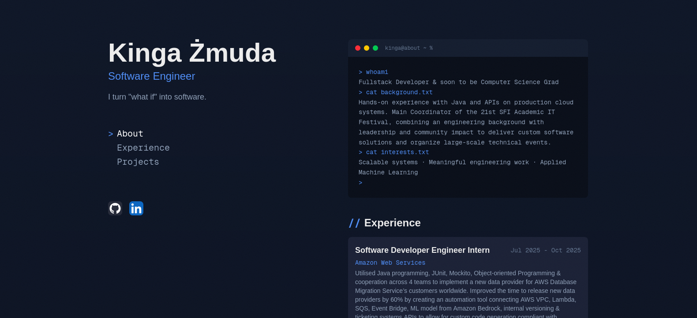
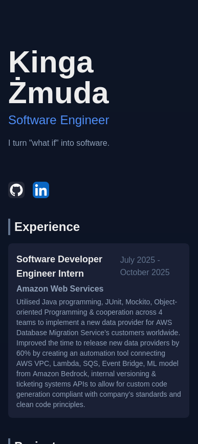

# [kingazmuda.com](kingazmuda.com)

Personal portfolio website built with Next.js and Tailwind CSS.

## Preview

<div style="display:flex; gap:12px; align-items:flex-start;">
  
  
</div>

## Tech Stack

- [Next.js](https://nextjs.org) - framework
- [Tailwind CSS](https://tailwindcss.com) - styling
- [skillicons.dev](https://skillicons.dev) - tech stack icons

## Getting Started

```bash
npm install
npm run dev
```

Open [http://localhost:3000](http://localhost:3000).

## Content

All content is driven by JSON files in `/data`:

| File | Description |
|------|-------------|
| `personal.json` | Name, title, descriptions, socials |
| `experience.json` | Work experience entries |
| `projects.json` | Projects with stack and optional thumbnail |
| `posts.json` | Curated LinkedIn posts |

Project thumbnails go in `public/thumbnails/`.

## Deployment

Deployed on [Vercel](https://vercel.com). Every push to `main` triggers an automatic redeploy.
